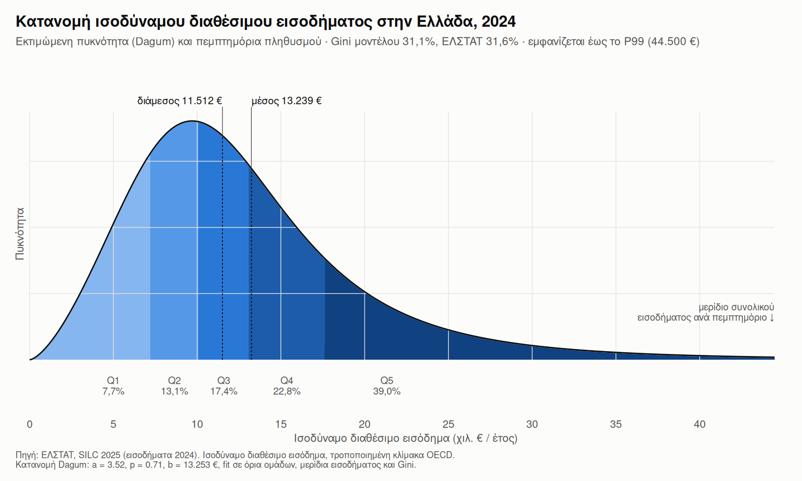

# Κατανομή ισοδύναμου διαθέσιμου εισοδήματος στην Ελλάδα — μοντέλο Dagum

Έρευνα SILC 2025 της ΕΛΣΤΑΤ, με έτος αναφοράς εισοδήματος το **2024**.

 

> Το αρχείο `.md` παράγεται από το `doc/dagum_2025.qmd`. Οι αριθμοί
> διαβάζονται από τα CSV στο `data/derived/` (βλ. την αρχή του `.qmd`
> για τη σειρά των scripts). Εξαίρεση είναι οι αριθμοί που παραθέτονται
> από άλλες πηγές (δείγμα της έρευνας, βιβλιογραφία), με την πηγή τους
> δίπλα.

## 1. Τι είναι το ισοδύναμο διαθέσιμο εισόδημα

**Διαθέσιμο εισόδημα νοικοκυριού** είναι το συνολικό **καθαρό** εισόδημα
όλων των μελών του νοικοκυριού (μετά από φόρους και ασφαλιστικές
εισφορές) από εργασία, περιουσία, συντάξεις, κοινωνικά επιδόματα και
μεταβιβάσεις από άλλα νοικοκυριά, για ένα ημερολογιακό έτος.

Για να συγκρίνονται νοικοκυριά διαφορετικού μεγέθους, το εισόδημα
διαιρείται με το **ισοδύναμο μέγεθος** του νοικοκυριού (τροποποιημένη
κλίμακα OECD, όπως στο `oecd_scale()` του `R/income_distribution.R`):

| Μέλος                  | Βάρος |
|------------------------|-------|
| 1ος ενήλικας           | 1,0   |
| κάθε άλλο άτομο 14+    | 0,5   |
| κάθε παιδί κάτω των 14 | 0,3   |

Παράδειγμα: ζευγάρι με ένα μωρό έχει μέγεθος 1 + 0,5 + 0,3 = **1,8**. Αν
το νοικοκυριό έχει 21.060 € καθαρά τον χρόνο, το ισοδύναμο εισόδημα
είναι 21.060 € / 1,8 = 11.700 €, δηλαδή η διάμεσος της χώρας.

Το ισοδύναμο εισόδημα αποδίδεται σε **κάθε άτομο** του νοικοκυριού. Άρα
η κατανομή είναι κατανομή **ατόμων** και δείχνει βιοτικό επίπεδο, όχι
μισθούς.

## 2. Τι δείχνουν τα δύο γραφήματα

### `figures/dagum_density_2025.png`: η κατανομή

- Η καμπύλη είναι η **πυκνότητα**: όσο πιο ψηλά, τόσο περισσότεροι
  άνθρωποι έχουν περίπου αυτό το εισόδημα. Το εμβαδόν κάτω από την
  καμπύλη ανάμεσα σε δύο τιμές είναι το ποσοστό του πληθυσμού με
  εισόδημα σε αυτό το διάστημα.
- Οι πέντε αποχρώσεις είναι τα **πεμπτημόρια**. Κάθε ζώνη έχει το ίδιο
  εμβαδόν (20% του πληθυσμού), γι’ αυτό οι ζώνες στενεύουν εκεί που η
  καμπύλη είναι ψηλή και απλώνονται στην ουρά.
- Κάτω από κάθε ζώνη φαίνεται το **μερίδιο του συνολικού εισοδήματος**
  που παίρνει κατά το μοντέλο: το φτωχότερο 20% παίρνει 7,7%, το
  πλουσιότερο 20% 39,0%.
- Οι κατακόρυφες γραμμές είναι η **διάμεσος** (11.512 €) και ο **μέσος**
  (13.239 €) του μοντέλου. Ο μέσος είναι δεξιότερα επειδή η κατανομή
  έχει μακριά δεξιά ουρά: λίγα υψηλά εισοδήματα τραβούν τον μέσο πάνω.
- Ο οριζόντιος άξονας κόβεται στο P99 του μοντέλου (44.500 €) για να
  διαβάζεται το σώμα της κατανομής. Το πλουσιότερο 1% υπάρχει στο
  μοντέλο αλλά δεν σχεδιάζεται.

### `figures/dagum_fit_2025.png`: έλεγχος προσαρμογής

- Η μπλε καμπύλη είναι η **αθροιστική κατανομή** του μοντέλου: για κάθε
  εισόδημα x, τι ποσοστό του πληθυσμού έχει εισόδημα έως x.
- Τα **μαύρα σημεία** είναι τα όρια ομάδων της ΕΛΣΤΑΤ, που
  χρησιμοποιήθηκαν στο fit.
- Τα **λευκά σημεία** είναι τα όρια δεκατημορίων και τα P95–P99 της
  Eurostat, που **δεν** χρησιμοποιήθηκαν στο fit. Είναι ανεξάρτητος
  έλεγχος: όσο πιο κοντά στην καμπύλη, τόσο καλύτερα περιγράφει το
  μοντέλο και σημεία που δεν «είδε».

## 3. Πηγές δεδομένων

| Πηγή | Τι πήραμε | Αρχείο στο repo |
|----|----|----|
| ΕΛΣΤΑΤ, *Income Inequality — 2025 Survey on Income and Living Conditions* ([σελίδα SILC της ΕΛΣΤΑΤ](https://www.statistics.gr/en/statistics/-/publication/SFA10/-)) | όρια και μερίδια τεταρτημορίων και πεμπτημορίων, Gini, S80/S20 | `research/Income inequality ( 2025 ).pdf` → `data/elstat_silc_groups.csv`, `data/elstat_silc_indicators.csv` |
| Eurostat [`ilc_di01`](https://ec.europa.eu/eurostat/databrowser/view/ilc_di01/default/table?lang=en), *Distribution of income by quantiles* | όρια δεκατημορίων, P1–P5, P95–P99 (για τον έλεγχο) | `data/eurostat/ilc_di01.csv` |
| Eurostat [`ilc_di03`](https://ec.europa.eu/eurostat/databrowser/view/ilc_di03/default/table?lang=en), *Mean and median income by age and sex* | πραγματικός μέσος και διάμεσος | `data/eurostat/ilc_di03.csv` |

Τα δεδομένα της Eurostat κατεβαίνουν από το [dissemination
API](https://ec.europa.eu/eurostat/api/dissemination/statistics/1.0/data/ilc_di03?geo=EL&format=JSON&lang=EN)
με `Rscript scripts/fetch_eurostat.R`. Είναι τα ίδια στοιχεία SILC που
δίνει η ΕΛΣΤΑΤ: τα όρια των πεμπτημορίων συμπίπτουν ακριβώς (ΕΛΣΤΑΤ
7.110 / 10.269 / 13.184 / 17.056 €, Eurostat 7.110 / 10.269 / 13.184 /
17.056 €).

## 4. Μέσος και διάμεσος: πραγματικές τιμές και μοντέλο

Υπάρχει πηγή για τις πραγματικές τιμές: ο πίνακας **Eurostat
`ilc_di03`**. Το PDF της ΕΛΣΤΑΤ δίνει τη διάμεσο έμμεσα, ως το ανώτατο
όριο του 2ου τεταρτημορίου (11.697 €), αλλά **δεν δίνει τον μέσο**.

|          | Πραγματικό (Eurostat `ilc_di03`) | Μοντέλο Dagum | Απόκλιση |
|:---------|---------------------------------:|--------------:|---------:|
| Μέσος    |                     **13.381 €** |      13.239 € |    −1,1% |
| Διάμεσος |                     **11.700 €** |      11.512 € |    −1,6% |

Οι τιμές που γράφει το γράφημα (11.512 € και 13.239 €) είναι **του
μοντέλου**:

- η διάμεσος είναι το σημείο της κατανομής όπου βρίσκεται ακριβώς το 50%
  του πληθυσμού,
- ο μέσος υπολογίζεται με τον κλειστό τύπο του μέσου της Dagum.

Ο μέσος **δεν** χρησιμοποιήθηκε στο fit, οπότε η απόκλιση −1,1% είναι
ανεξάρτητη επιβεβαίωση του μοντέλου. Για όλα τα έτη 2015–2025 η απόκλιση
μέσου και διαμέσου μένει κάτω από 1,9%:

| Έρευνα (εισοδήματα) | Μέσος πραγματικός | Μέσος μοντέλου | Απόκλιση μέσου | Διάμεσος πραγματική | Διάμεσος μοντέλου | Απόκλιση διαμέσου |
|:---|---:|---:|---:|---:|---:|---:|
| 2015 (2014) | 8.683 € | 8.723 € | +0,5% | 7.520 € | 7.543 € | +0,3% |
| 2016 (2015) | 8.673 € | 8.767 € | +1,1% | 7.500 € | 7.570 € | +0,9% |
| 2017 (2016) | 8.800 € | 8.872 € | +0,8% | 7.600 € | 7.691 € | +1,2% |
| 2018 (2017) | 9.034 € | 9.110 € | +0,8% | 7.863 € | 7.889 € | +0,3% |
| 2019 (2018) | 9.382 € | 9.395 € | +0,1% | 8.195 € | 8.264 € | +0,8% |
| 2020 (2019) | 10.041 € | 10.080 € | +0,4% | 8.781 € | 8.813 € | +0,4% |
| 2021 (2020) | 9.952 € | 9.989 € | +0,4% | 8.752 € | 8.784 € | +0,4% |
| 2022 (2021) | 10.832 € | 10.887 € | +0,5% | 9.520 € | 9.521 € | +0,0% |
| 2023 (2022) | 11.546 € | 11.513 € | −0,3% | 10.050 € | 9.977 € | −0,7% |
| 2024 (2023) | 12.391 € | 12.263 € | −1,0% | 10.850 € | 10.644 € | −1,9% |
| 2025 (2024) | 13.381 € | 13.239 € | −1,1% | 11.700 € | 11.512 € | −1,6% |

Ο ίδιος πίνακας δίνει και τιμές για τα παιδιά. Για παιδιά κάτω των 6
ετών η διάμεσος είναι 11.175 € και ο μέσος 12.912 €, και για παιδιά κάτω
των 18 10.813 € και 12.347 €. Και οι δύο ομάδες βρίσκονται κάτω από τον
συνολικό πληθυσμό (11.700 € και 13.381 €).

## 5. Πώς κατασκευάστηκε

### 5.1 Δεδομένα-στόχοι

Από το δελτίο της ΕΛΣΤΑΤ για το 2025 πήραμε 17 αριθμούς:

- 7 όρια ομάδων (P20, P25, P40, P50, P60, P75, P80),
- 4 μερίδια εισοδήματος τεταρτημορίων και 5 πεμπτημορίων,
- τον δείκτη Gini (31,6%).

### 5.2 Επιλογή μοντέλου

Χρειαζόμασταν μια συνεχή κατανομή που να περιγράφει όλο τον πληθυσμό.
Δοκιμάστηκαν τρεις, όλες με fit στους ίδιους 17 στόχους:

| Κατανομή | Παράμετροι | Διάμεσος | Gini | Μερίδια πεμπτημορίων | Μέγιστη απόκλιση ορίων ομάδων |
|:---|---:|---:|---:|:--:|---:|
| Pareto | 2 | 10.788 € | 32,5% | 10,7% / 12,2% / 14,4% / 18,6% / 44,1% | ±20,5% |
| Lognormal | 2 | 11.391 € | 30,8% | 8,0% / 12,7% / 17,1% / 23,1% / 39,0% | ±7,1% |
| Dagum | 3 | 11.512 € | 31,1% | 7,7% / 13,1% / 17,4% / 22,8% / 39,0% | ±3,3% |
| ΕΛΣΤΑΤ | — | 11.697 € | 31,6% | 7,6% / 13,2% / 17,5% / 22,3% / 39,3% | — |

- **Pareto:** δίνει μερίδιο 10,7% για το φτωχότερο 20% αντί για 7,6%,
  και αποκλίνει έως 20,5% στα όρια των ομάδων. Η Pareto έχει ελάχιστο
  εισόδημα και μετά μόνο φθίνουσα πυκνότητα, οπότε περιγράφει μόνο την
  ουρά των υψηλών εισοδημάτων, όχι το σώμα της κατανομής.
- **Lognormal:** πιο κοντά, αλλά με Gini 30,8% αντί για 31,6% και
  απόκλιση έως 7,1% στα όρια.
- **Dagum (Burr III):** η κλασική κατανομή για εισοδήματα στη
  βιβλιογραφία. Στο πάνω άκρο συμπεριφέρεται σαν Pareto, αλλά έχει και
  ρεαλιστικό σώμα. Έχει τη μικρότερη απόκλιση (3,3%). Επιλέχθηκε για όλα
  τα έτη, για να είναι συγκρίσιμα.

Η Dagum έχει τρεις παραμέτρους: δύο για το σχήμα (a, p) και μία κλίμακας
(b, σε €).

### 5.3 Fit

Βρήκαμε τα a, p, b που φέρνουν το μοντέλο όσο πιο κοντά γίνεται και
στους 17 στόχους ταυτόχρονα (ελάχιστα τετράγωνα στη λογαριθμική κλίμακα,
ώστε κάθε στόχος να μετράει ως σχετικό σφάλμα). Τα μερίδια και το Gini
υπολογίζονται με ακριβείς τύπους της Dagum, χωρίς προσομοίωση.
Αποτέλεσμα για το 2025: **a = 3,52, p = 0,71, b = 13.253 €**.

### 5.4 Έλεγχος

- **Σε σύγκριση με τους στόχους:** όρια ομάδων μέσα σε ±3,3%, μερίδια
  μέσα σε ±2,4%, Gini 31,1% αντί για 31,6%.
- **Σε σύγκριση με στοιχεία που το μοντέλο δεν είδε:** 14 όρια της
  Eurostat (P1, P2, P3, P4, P5, D1, D3, D7, D9, P95, P96, P97, P98,
  P99). Όσα αντιστοιχούν σε ίδιο ποσοστό πληθυσμού με κάποιον στόχο της
  ΕΛΣΤΑΤ (π.χ. D2 = P20) παραλείπονται, γιατί είναι ο ίδιος αριθμός. Τα
  11 είναι μέσα σε ±4,8%, και 3 αποκλίνουν πάνω από 5%:

| Σημείο | Eurostat |  Μοντέλο | Απόκλιση |
|:-------|---------:|---------:|---------:|
| P1     |  1.700 € |  2.117 € |   +24,5% |
| D9     | 20.796 € | 22.357 € |    +7,5% |
| P99    | 49.279 € | 44.465 € |    −9,8% |

Άρα το μοντέλο περιγράφει καλά το σώμα της κατανομής, αλλά όχι τα άκρα:

- στο **πολύ χαμηλό άκρο** (P1) δίνει μεγαλύτερο εισόδημα από το
  πραγματικό
- στο **ανώτερο-μεσαίο στρώμα** (D9) δίνει μεγαλύτερο εισόδημα από το
  πραγματικό
- στην **ακραία κορυφή** (P99) δίνει μικρότερο εισόδημα από το
  πραγματικό

### 5.5 Γραφήματα

Με ggplot2. Κώδικας: `R/income_distribution.R` (μοντέλο και fit) και
`scripts/plot_income_distribution.R` (γραφήματα:
`Rscript scripts/plot_income_distribution.R 2025`).

## Περιορισμοί

- Το SILC είναι δειγματοληπτική έρευνα (10.408 νοικοκυριά το 2025, κατά
  το δελτίο της ΕΛΣΤΑΤ) και **υποεκτιμά τα πολύ υψηλά εισοδήματα**.
- Η κατανομή αφορά **όλον τον πληθυσμό**. Ομάδες με διαφορετικά
  εισοδήματα έχουν δικές τους κατανομές: για τους κάτω των 65 και τους
  18–64 στο `doc/medians_quartiles.md` και στα
  `figures/dagum_*_age.png`, για τύπους νοικοκυριού στο
  `doc/household_types.md`.
- Το fit μπορεί να βελτιωθεί βάζοντας και τα δεκατημόρια της Eurostat
  στους στόχους.
