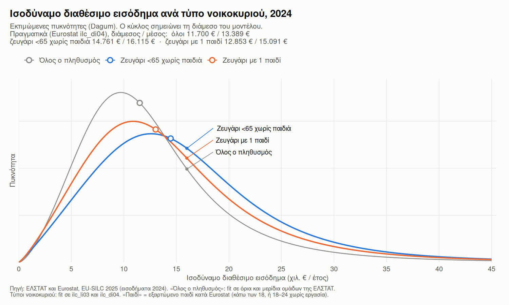
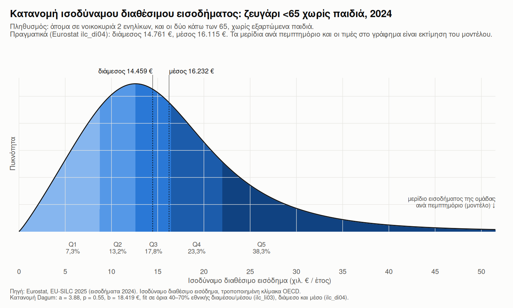
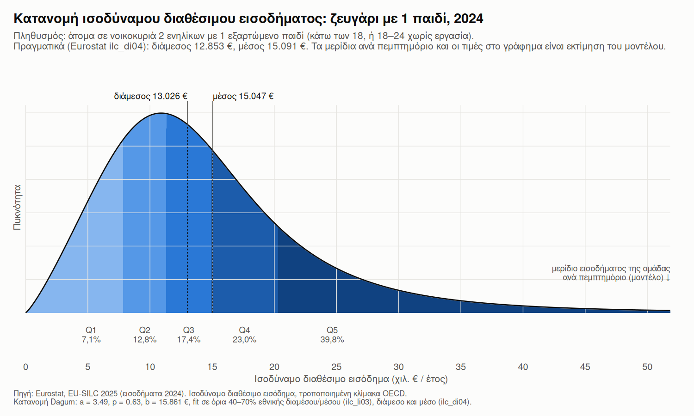
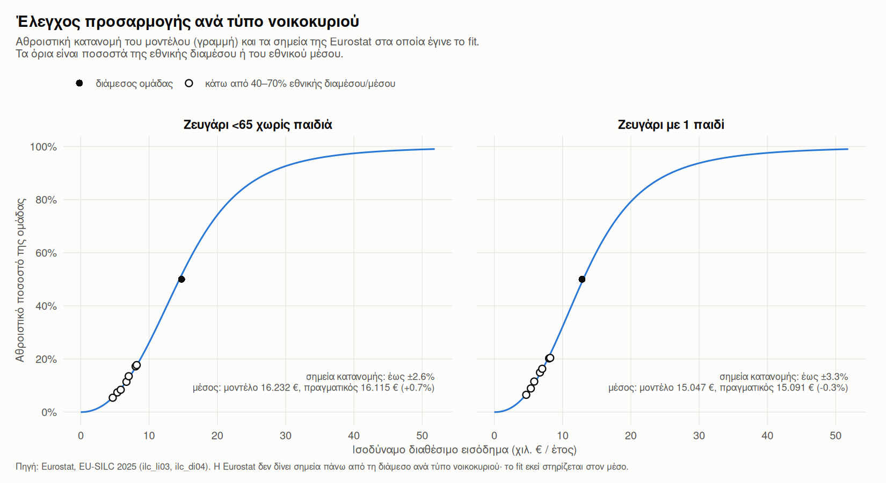

# Εισόδημα ανά τύπο νοικοκυριού: ζευγάρι χωρίς παιδιά και ζευγάρι με 1 παιδί

SILC 2025 (Eurostat), με εισοδήματα του **2024**. Όλα τα ποσά είναι
**ισοδύναμο διαθέσιμο εισόδημα**, εκτός αν γράφει «εισόδημα
νοικοκυριού». Ισοδύναμο εισόδημα = καθαρό εισόδημα του νοικοκυριού
διαιρεμένο με το ισοδύναμο μέγεθός του (τροποποιημένη κλίμακα ΟΟΣΑ: 1
για τον πρώτο ενήλικα, 0,5 για κάθε άλλο άτομο 14 ετών και πάνω, 0,3 για
κάθε παιδί κάτω των 14).

> Το αρχείο `.md` παράγεται από το `doc/household_types.qmd`. Όλοι οι
> αριθμοί διαβάζονται από τα CSV στο `data/derived/`, που γράφει το
> `scripts/household_types.R`.

## 1. Οι δύο τύποι νοικοκυριού

- **Ζευγάρι \<65 χωρίς παιδιά** (Eurostat `A2_2LT65`): άτομα σε
  νοικοκυριά 2 ενηλίκων, και οι δύο κάτω των 65, χωρίς εξαρτώμενα
  παιδιά.
- **Ζευγάρι με 1 παιδί** (Eurostat `A2_DCH1`): άτομα σε νοικοκυριά 2
  ενηλίκων με 1 εξαρτώμενο παιδί (κάτω των 18, ή 18–24 χωρίς εργασία).

Δύο διευκρινίσεις για το «ζευγάρι με 1 παιδί»:

- **Δεν έχει όριο ηλικίας για τους ενήλικες.** Η Eurostat δεν δίνει
  εκδοχή μόνο για κάτω των 65, αλλά στην πράξη οι 65+ με εξαρτώμενο
  παιδί είναι λίγοι.
- **Το παιδί δεν είναι απαραίτητα μικρό.** Περιλαμβάνει και φοιτητές έως
  24 ετών, οπότε η ομάδα μιγνύει ζευγάρια 30 ετών με μωρό και ζευγάρια
  50 ετών με φοιτητή. Οι οικογένειες με μωρό είναι μάλλον λίγο κάτω από
  τη διάμεσο της ομάδας.

Για τύπους με σταθερό αριθμό μελών (2 ή 3 άτομα), η διάμεσος των ατόμων
συμπίπτει με τη διάμεσο των νοικοκυριών. Εδώ λοιπόν το «οικογένεια στη
διάμεσο» έχει κυριολεκτικό νόημα.

## 2. Διάμεσος και μέσος: πραγματικές τιμές

Πηγή: Eurostat
[`ilc_di04`](https://ec.europa.eu/eurostat/databrowser/view/ilc_di04/default/table?lang=en)
(*Distribution of income by household composition*).

| Ομάδα                     | **Διάμεσος** |    Μέσος | Διάμεσος / συνολική |
|:--------------------------|-------------:|---------:|--------------------:|
| Όλος ο πληθυσμός          | **11.700 €** | 13.389 € |                   — |
| Ζευγάρι \<65 χωρίς παιδιά | **14.761 €** | 16.115 € |              +26,2% |
| Ζευγάρι με 1 παιδί        | **12.853 €** | 15.091 € |               +9,9% |

Το μεσαίο ζευγάρι με παιδί έχει **12,9%** χαμηλότερο βιοτικό επίπεδο από
το μεσαίο ζευγάρι χωρίς παιδιά, γιατί το εισόδημά του μοιράζεται σε
περισσότερα άτομα.

### Ανά έτος (διάμεσοι)

| Έρευνα (εισοδήματα) | Όλος ο πληθυσμός | Ζευγάρι \<65 χωρίς παιδιά | Ζευγάρι με 1 παιδί |
|:---|---:|---:|---:|
| 2015 (2014) | 7.527 € | 8.827 € | 8.603 € |
| 2016 (2015) | 7.504 € | 8.633 € | 8.178 € |
| 2017 (2016) | 7.611 € | 8.633 € | 8.398 € |
| 2018 (2017) | 7.875 € | 9.147 € | 8.595 € |
| 2019 (2018) | 8.200 € | 10.000 € | 9.601 € |
| 2020 (2019) | 8.781 € | 10.333 € | 10.409 € |
| 2021 (2020) | 8.755 € | 10.253 € | 9.995 € |
| 2022 (2021) | 9.520 € | 11.543 € | 10.344 € |
| 2023 (2022) | 10.060 € | 11.923 € | 11.051 € |
| 2024 (2023) | 10.862 € | 13.180 € | 11.547 € |
| 2025 (2024) | 11.700 € | 14.761 € | 12.853 € |

## 3. Η οικογένεια στη διάμεσο: πόσα βγάζει ως νοικοκυριό

Καθαρό εισόδημα νοικοκυριού = πραγματική διάμεσος του τύπου × ισοδύναμο
μέγεθος. Ο πολλαπλασιασμός είναι ακριβής, όχι μοντέλο. Για το ζευγάρι με
παιδί το μέγεθος εξαρτάται από την ηλικία του παιδιού (0,3 κάτω των 14,
0,5 από 14 και πάνω), ενώ η Eurostat δίνει μία διάμεσο για όλη την
ομάδα.

| Οικογένεια στη διάμεσο | Διάμεσος ισοδύναμου | Μέγεθος | **Εισόδημα νοικοκυριού / έτος** | ÷ 12 | ÷ 14 | 1.200 € ως % του εισοδήματος |
|:---|---:|---:|---:|---:|---:|---:|
| Ζευγάρι \<65 χωρίς παιδιά | 14.761 € | 1,5 | **22.142 €** | 1.845 € | 1.582 € | 5,4% |
| Ζευγάρι με 1 παιδί, παιδί κάτω των 14 | 12.853 € | 1,8 | **23.135 €** | 1.928 € | 1.653 € | 5,2% |
| Ζευγάρι με 1 παιδί, παιδί 14–24 | 12.853 € | 2,0 | **25.706 €** | 2.142 € | 1.836 € | 4,7% |

Το ÷14 αφορά μισθωτούς με δώρα και επίδομα αδείας. Η τελευταία στήλη
δείχνει τι ποσοστό του εισοδήματος χρειάζεται για να πάρει μια
οικογένεια το πλήρες κρατικό matching του πρώτου έτους.

Για το μέτρο του επενδυτικού λογαριασμού η σχετική γραμμή είναι η
οικογένεια με **παιδί κάτω των 14**: **23.135 €** καθαρά τον χρόνο στη
διάμεσο. Είναι 994 € περισσότερα από το μεσαίο ζευγάρι χωρίς παιδιά,
αλλά για τρία άτομα αντί για δύο. Το πλήρες matching ζητά από αυτή την
οικογένεια το **5,2%** του καθαρού εισοδήματός της.

## 4. Οι κατανομές

Οι καμπύλες είναι κατανομές Dagum, με fit στα στοιχεία που δημοσιεύει η
Eurostat ανά τύπο νοικοκυριού:

- **`ilc_li03`:** ποσοστό της ομάδας κάτω από 40/50/60/70% της εθνικής
  διαμέσου και 40/50/60% του εθνικού μέσου (7 σημεία της κατανομής),
- **`ilc_di04`:** διάμεσος και μέσος της ομάδας.

Πάνω από τη διάμεσο δεν δημοσιεύεται κανένα σημείο. Εκεί το σχήμα της
καμπύλης στηρίζεται μόνο στον μέσο και στη μορφή της Dagum.

| Ομάδα | Διάμεσος πραγματική / μοντέλου | Μέσος πραγματικός / μοντέλου | Μέγιστη απόκλιση στόχων | P25 / P75 μοντέλου | Gini μοντέλου |
|:---|---:|---:|---:|---:|---:|
| Ζευγάρι \<65 χωρίς παιδιά | 14.761 € / 14.459 € | 16.115 € / 16.232 € | ±2,6% | 9.777 € / 20.247 € | 31,0% |
| Ζευγάρι με 1 παιδί | 12.853 € / 13.026 € | 15.091 € / 15.047 € | ±3,3% | 8.765 € / 18.582 € | 32,5% |

Τα P25, P75 και Gini είναι **εκτιμήσεις του μοντέλου**. Η Eurostat δεν
τα δημοσιεύει ανά τύπο νοικοκυριού.
